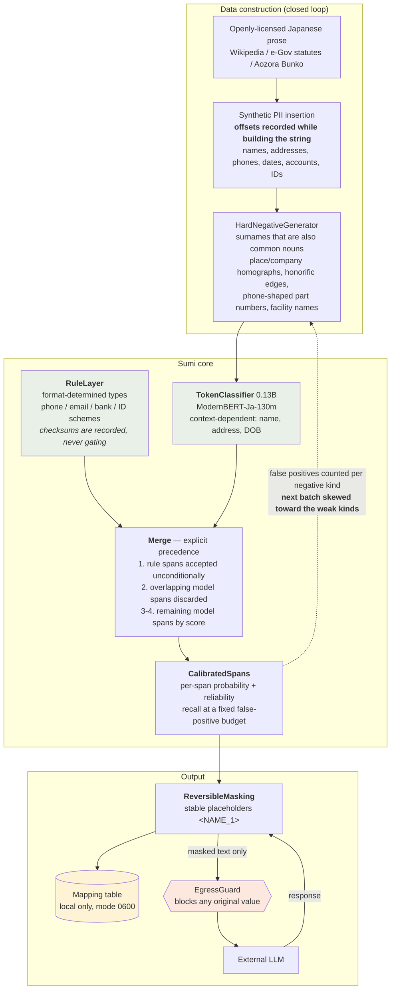
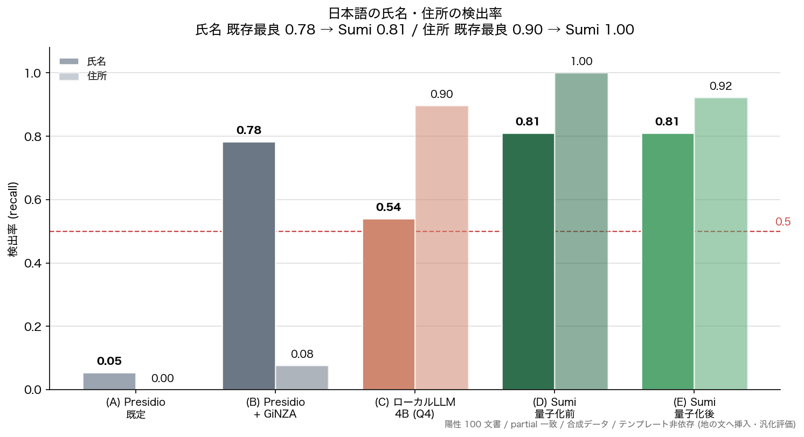
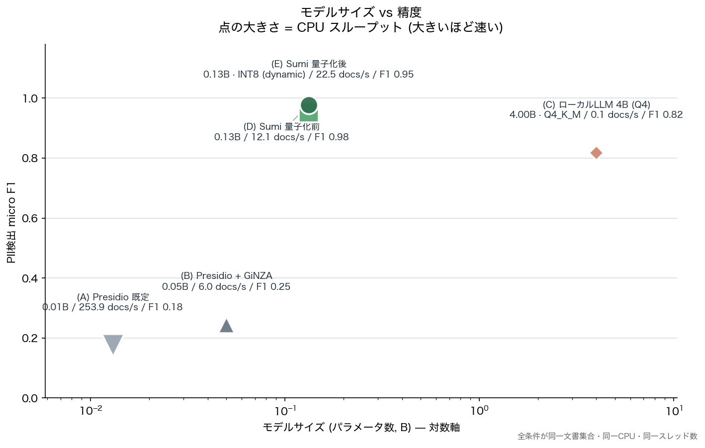
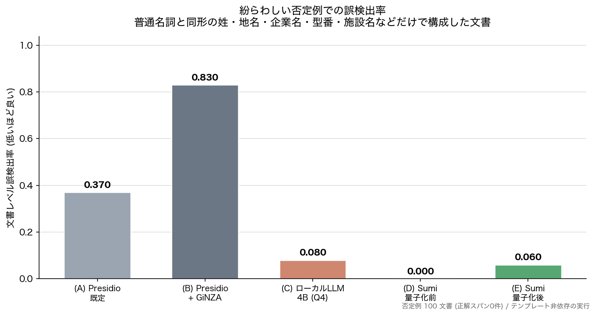
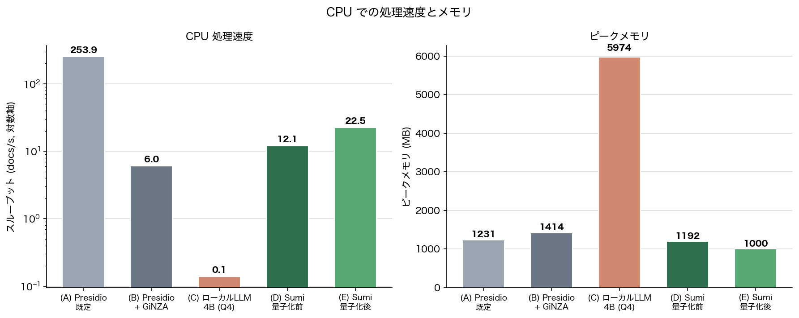
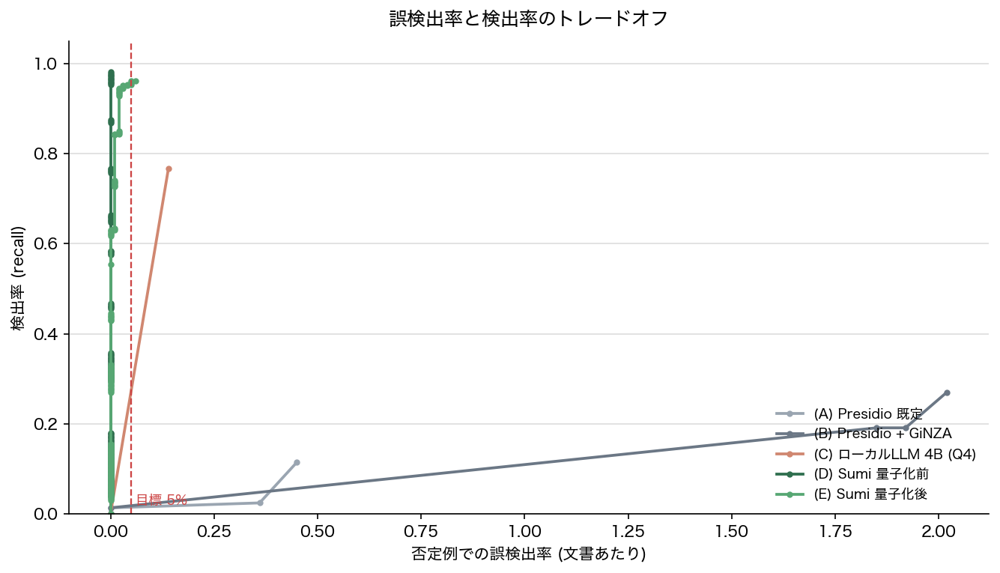
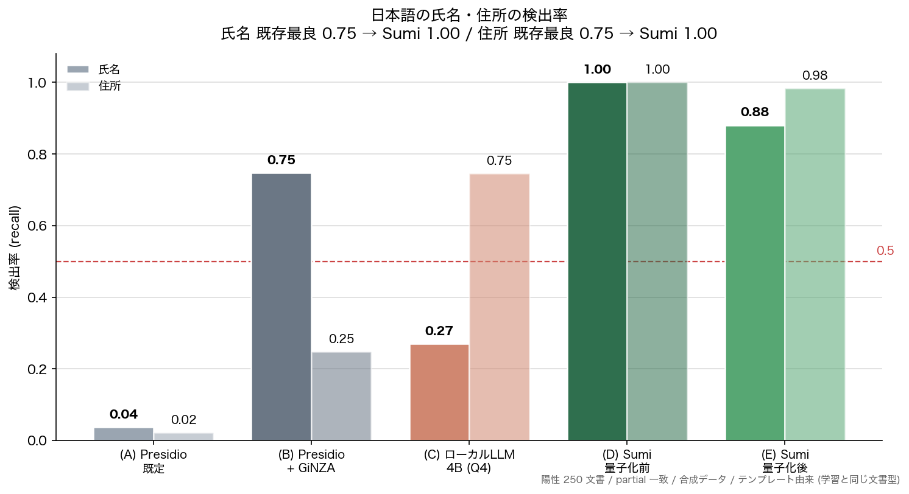
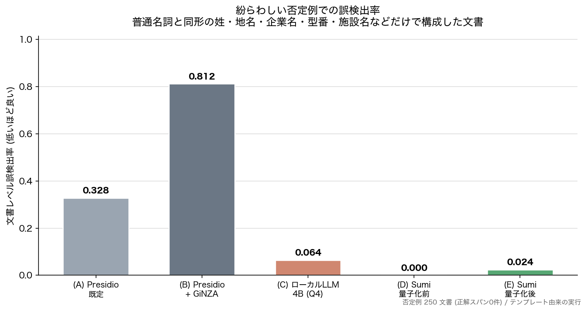

# 墨 Sumi — Japanese PII detection that holds up on hard negatives

[](https://huggingface.co/NagaYu/sumi-ja-pii)
[](https://huggingface.co/datasets/NagaYu/sumi-ja-pii-corpus)
[](https://huggingface.co/spaces/NagaYu/sumi)
[](LICENSE)
[](https://github.com/NagaYu/sumi/actions/workflows/ci.yml)

**English-first PII detectors stumble on Japanese names and addresses. Sumi closes
that gap with a 0.13B token classifier that runs on CPU, and drops into Presidio in
one line.**

> [!WARNING]
> **Sumi does not guarantee legal or regulatory compliance.** It is a tool for
> *reducing the risk* of personal data leaving your machine — not a complete
> detector. Misses will happen. You choose the threshold and the use case.
> All training and evaluation data is synthetic; **no real personal
> information is used anywhere in this project.**

## Why this exists

Running an English-configured Presidio over Japanese text finds the email address
and little else. Adding a Japanese NER model helps with names, but it also starts
firing on prefecture names, company names and part numbers that merely *look* like
personal data. The usual escape hatch — prompting a local 4B LLM — is accurate
enough but two orders of magnitude too slow on CPU.

Sumi is the fourth option: a small, fast model trained specifically on the
confusions that matter in Japanese, with a rule layer for the formats that do not
need a model, and a reversible masking path so you can still use an external LLM
without shipping the original values.

**162× faster than a 4B local LLM on the same CPU** (22.5 vs 0.14 docs/s), using 1000 MB against 5974 MB.

## Try it

**[Live demo](https://huggingface.co/spaces/NagaYu/sumi)** — runs entirely in your
browser via transformers.js. Nothing you paste is uploaded anywhere, which for a
redaction tool seemed like the only honest way to build a demo. The browser port
reads its rules from the same generated bundle the library uses, and
[`parity.html`](https://nagayu-sumi.static.hf.space/parity.html) checks it span-for-span
against Python reference output.

## Install

```bash
git clone https://github.com/NagaYu/sumi.git
cd sumi
pip install -e ".[presidio,onnx,app]"
```

## Use it

### Drop into Presidio (three lines)

```python
from presidio_analyzer import RecognizerRegistry
from sumi.presidio_plugin import register
register(registry)   # that is the whole integration
```

Sumi maps onto Presidio's own entity names (`PERSON`, `LOCATION`, `PHONE_NUMBER`,
`EMAIL_ADDRESS`, `DATE_TIME`, `CREDIT_CARD`, plus `JP_BANK_ACCOUNT`,
`JP_MY_NUMBER`, `JP_MEMBER_ID`, `JP_POSTAL_CODE`), so an existing
`AnonymizerEngine` pipeline keeps working unchanged. It does **not** require spaCy
or GiNZA — Sumi analyses Japanese itself.

### Command line

```bash
sumi redact input.txt --out masked.txt --map map.json   # redact, keep the mapping
sumi restore masked.txt --map map.json --out out.txt    # restore afterwards
```

The mapping file is written with mode `0600` and never leaves the machine.

### Python

```python
from sumi import SumiDetector
from sumi.mask import ReversibleMasker

det = SumiDetector("path/to/model")
masked, mapping = det.redact("田中太郎様の連絡先は090-1234-5678です。")
# '<NAME_1>様の連絡先は<PHONE_1>です。'

restored = ReversibleMasker().unmask(llm_response, mapping)
```

### Send masked text to an LLM, safely

```python
from sumi.mask import LLMRoundTrip

result = LLMRoundTrip(my_transport).run(text, det.detect(text),
                                        instruction="Summarise this document.")
result["response"]   # the LLM's answer, with the original values restored
```

`LLMRoundTrip` routes every outbound payload through an `EgressGuard` built from the
mapping table. If any original value — raw, NFKC-normalised, or digits-only — would
be transmitted, the send is **blocked** rather than logged. The test suite asserts
this over every synthetic document it generates.

## How it works



### Three design decisions worth calling out

1. **Checksums never gate detection.** Card-shaped and My-Number-shaped strings are
   detected by *format*; whether the check digit validates is recorded in
   `meta["checksum_valid"]` and nothing more. The point of redaction is to leave
   nothing that looks like personal data, so a number with a bad check digit is not
   a number you may ignore.
2. **The merge order is explicit.** "Rules win where rules are certain, model
   elsewhere" is implemented as five ordered steps in `sumi.rules.merge_spans`,
   not as an implicit score comparison.
3. **Hard negatives are a closed loop.** After training, false positives on the
   negative subset are counted *per confusion type*, and those counts skew the
   generation distribution for the next batch
   (`HardNegativeGenerator.reweight_from_errors`).

## Compared against

| | Condition |
|---|---|
| (A) | Presidio with its default (English) configuration |
| (B) | Presidio + GiNZA — a fair, carefully-mapped Japanese NER setup, not a straw man: GiNZA's 189 extended-NE labels are mapped onto Presidio entities and adjacent place fragments are joined into full addresses |
| (C) | Qwen3-4B-Instruct (Q4_K_M) via llama.cpp, CPU only, prompted to extract PII |
| (D) | Sumi, fp32 PyTorch on CPU |
| (E) | Sumi, ONNX INT8 on CPU |

## Evaluation — generalisation (the honest numbers)

The training documents come from business-document templates (email, meeting
minutes, application forms, support tickets). **Measuring only on documents from
those same templates would reward a model that merely memorised the slots.**

This section uses a *template-independent* set: synthetic PII inserted directly
into Wikipedia / statute / literary prose, 100 positive and
100 negative documents. Each inserted sentence is phrased so the label
is actually valid ("The date of birth is {value}."), but no business-document
template is used.

| Condition | Name | Address | Phone | Birth date | Email | Bank acct | My Number | Member ID | micro F1  FP rate |
|---|---|---|---|---|---|---|---|---|---|---|
| (A) Presidio, default | 0.054 | 0.000 | 0.917 | 0.053 | 0.192 | 0.000 | 0.000 | 0.000 | 0.176 | 0.370 |
| (B) Presidio + GiNZA | 0.784 | 0.077 | 0.833 | 0.789 | 0.231 | 0.000 | 0.000 | 0.024 | 0.245 | 0.830 |
| (C) Local LLM 4B (Q4) | 0.541 | 0.897 | 0.917 | 0.947 | 1.000 | 0.683 | 0.676 | 0.659 | 0.818 | 0.080 |
| (D) Sumi fp32 | 0.811 | 1.000 | 1.000 | 1.000 | 1.000 | 1.000 | 1.000 | 1.000 | 0.978 | 0.000 |
| (E) Sumi INT8 | 0.811 | 0.923 | 1.000 | 0.895 | 1.000 | 1.000 | 1.000 | 1.000 | 0.953 | 0.060 |

### Recall at a fixed false-positive budget

In practice the question is not "how much can it find" but "how much can it find
while keeping false positives at a level we can live with".

| Condition | Threshold | Actual FPR | Overall recall | Name | Address |
|---|---|---|---|---|---|
| (A) Presidio, default | 1.000 | 0.000 | **0.014** | 0.000 | 0.000 |
| (B) Presidio + GiNZA | 1.000 | 0.000 | **0.014** | 0.000 | 0.000 |
| (C) Local LLM 4B (Q4) | 0.900 | 0.000 | **0.000** | 0.000 | 0.000 |
| (D) Sumi fp32 | 0.504 | 0.000 | **0.981** | 0.811 | 1.000 |
| (E) Sumi INT8 | 0.510 | 0.050 | **0.962** | 0.811 | 0.923 |

### CPU throughput and memory

| Condition | Size | docs/s | ms/doc | Peak RSS (MB) | vs (C) |
|---|---|---|---|---|---|
| (A) Presidio, default | 0.01B | 253.93 | 4 | 1231 | **1825×** |
| (B) Presidio + GiNZA | 0.05B | 6.05 | 165 | 1414 | **43×** |
| (C) Local LLM 4B (Q4) | 4.00B | 0.14 | 7187 | 5974 | baseline |
| (D) Sumi fp32 | 0.13B | 12.05 | 83 | 1192 | **87×** |
| (E) Sumi INT8 | 0.13B | 22.54 | 44 | 1000 | **162×** |

### Calibration

| Condition | ECE (lower is better) |
|---|---|
| (A) Presidio, default | 0.475 |
| (B) Presidio + GiNZA | 0.675 |
| (C) Local LLM 4B (Q4) | n/a (constant scores) |
| (D) Sumi fp32 | 0.088 |
| (E) Sumi INT8 | 0.067 |

<details>
<summary><b>Evaluation — in-distribution (inflated, kept for completeness)</b></summary>

The positive documents here come from the same templates as the training data, so
Sumi's recall is inflated. The negative subset is unaffected by this, because it
shares no templates with training.

All conditions processed the identical document set (250 positive /
250 negative) on the same CPU with the same thread count, each in its own
process so peak memory is attributed correctly.

| Condition | Name | Address | Phone | Birth date | Email | Bank acct | My Number | Member ID | micro F1 |
|---|---|---|---|---|---|---|---|---|---|
| (A) Presidio, default | 0.037 | 0.023 | 0.944 | 0.284 | 0.782 | 0.041 | 0.000 | 0.000 | 0.298 |
| (B) Presidio + GiNZA | 0.747 | 0.249 | 0.768 | 0.927 | 0.782 | 0.000 | 0.000 | 0.047 | 0.581 |
| (C) Local LLM 4B (Q4) | 0.270 | 0.746 | 0.782 | 1.000 | 0.944 | 0.767 | 1.000 | 0.774 | 0.665 |
| (D) Sumi fp32 | 1.000 | 1.000 | 1.000 | 1.000 | 1.000 | 1.000 | 1.000 | 1.000 | 1.000 |
| (E) Sumi INT8 | 0.881 | 0.983 | 1.000 | 0.945 | 1.000 | 0.986 | 1.000 | 1.000 | 0.939 |

#### False positives on confusable negatives

| Condition | Doc-level FP rate | FP per doc | Total FP | Dominant error kinds |
|---|---|---|---|---|
| (A) Presidio, default | **0.328** | 0.384 | 96 | `phone_like_id`=56, `date_like_nondob`=10, `number_like_id`=8 |
| (B) Presidio + GiNZA | **0.812** | 1.932 | 483 | `date_like_nondob`=132, `other`=82, `phone_like_id`=61 |
| (C) Local LLM 4B (Q4) | **0.064** | 0.100 | 25 | `phone_like_id`=14, `date_like_nondob`=5, `other`=3 |
| (D) Sumi fp32 | **0.000** | 0.000 | 0 | — |
| (E) Sumi INT8 | **0.024** | 0.024 | 6 | `other`=5, `honorific_boundary`=1 |

#### Recall at a fixed false-positive budget

| Condition | Threshold | Actual FPR | Overall recall | Name | Address |
|---|---|---|---|---|---|
| (A) Presidio, default | 1.000 | 0.000 | **0.070** | 0.000 | 0.000 |
| (B) Presidio + GiNZA | 1.000 | 0.000 | **0.070** | 0.000 | 0.000 |
| (C) Local LLM 4B (Q4) | 0.900 | 0.000 | **0.000** | 0.000 | 0.000 |
| (D) Sumi fp32 | 0.700 | 0.000 | **1.000** | 1.000 | 1.000 |
| (E) Sumi INT8 | 0.506 | 0.024 | **0.940** | 0.881 | 0.983 |

#### Speed and memory

| Condition | Size | docs/s | ms/doc | Peak RSS (MB) | vs (C) |
|---|---|---|---|---|---|
| (A) Presidio, default | 0.01B | 106.43 | 9 | 1237 | **1415×** |
| (B) Presidio + GiNZA | 0.05B | 5.90 | 169 | 1430 | **79×** |
| (C) Local LLM 4B (Q4) | 4.00B | 0.08 | 13301 | 6042 | baseline |
| (D) Sumi fp32 | 0.13B | 9.47 | 106 | 1185 | **126×** |
| (E) Sumi INT8 | 0.13B | 19.46 | 51 | 1019 | **259×** |

#### Calibration

| Condition | ECE (lower is better) |
|---|---|
| (A) Presidio, default | 0.502 |
| (B) Presidio + GiNZA | 0.424 |
| (C) Local LLM 4B (Q4) | n/a (constant scores) |
| (D) Sumi fp32 | n/a (constant scores) |
| (E) Sumi INT8 | 0.036 |

</details>

## Figures




***Headline figure 1 (generalisation).** Name and address recall on the template-independent set. The subtitle numbers are generated from the measurements, not written by hand.*



***Headline figure 2 (generalisation).** Model size vs accuracy — the 4B local LLM (C) and the 0.13B Sumi (D)(E) on one plane. Marker area is CPU throughput.*



*False-positive rate on deliberately confusable negatives — the main battleground.*



*CPU throughput and peak memory.*



*The recall / false-positive trade-off.*



*(reference) In-distribution recall. Same document templates as training, so it is inflated — see the generalisation section.*



*(reference) In-distribution false-positive rate.*


## Model

- Base: [`sbintuitions/modernbert-ja-130m`](https://huggingface.co/sbintuitions/modernbert-ja-130m) (MIT)
- Parameters: 132M (0.13B)
- Labels: 21 BIO classes (10 types × B/I, plus O)
- A span's probability is the **minimum** over its constituent token probabilities —
  the weakest link, not the average
- ONNX INT8: **133 MB** (from 530 MB fp32), argmax agreement 1.0000

### Distribution formats

| Format | Runnable | Use |
|---|---|---|
| PyTorch (safetensors) | yes | training, research |
| ONNX fp32 / INT8 | yes | **the CPU path** (condition (E)) |
| MLX (safetensors) | yes | Apple Silicon |
| GGUF | **no** | weights exported for tooling compatibility only — no mainstream runtime executes ModernBERT token classification from GGUF |

## Data

Everything is synthetic. See the [dataset card](https://huggingface.co/datasets/NagaYu/sumi-ja-pii-corpus).

- Base prose: Japanese Wikipedia (CC BY-SA 4.0), e-Gov statutes (not subject to
  copyright under Article 13 of the Japanese Copyright Act), Aozora Bunko
  (public domain). Licence and source are recorded per document.
- PII is generated with seeded RNGs and inserted **while recording offsets**, so the
  gold spans are correct by construction rather than by post-hoc search.
- Surnames follow an approximation of the real Japanese frequency distribution;
  addresses combine real public place names with **randomised** block/lot numbers;
  emails only ever use reserved domains (`example.*`, `.test`, `.invalid`).
- **Identifiers with check digits are format-valid and value-invalid by
  construction** — Luhn and the My Number check digit are deliberately violated, so
  no usable number can be produced. Tests assert this over thousands of samples.

## Limitations

- **On personal names alone, Sumi's lead is small.** On the template-independent set Sumi reaches 0.81 against 0.78 for Presidio + GiNZA. Sumi's advantage is not name recall in isolation — it is addresses, the ID/number families, and above all the false-positive rate.
- **Trained and evaluated entirely on synthetic data.** Behaviour on your real
  documents will differ. Validate on your own data before deploying.
- **Misses are certain.** Lowering the threshold raises recall and also raises false
  positives; the trade-off table above is the honest picture of that.
- **Sumi is not a compliance control.** It reduces risk; it does not certify anything.
- **GGUF is exported but not executable** — no mainstream runtime currently runs
  ModernBERT-style token classification from GGUF. Use ONNX INT8 on CPU.
- **Japanese proofreading / typo detection is deliberately out of scope** (JWTD and
  existing public models already cover that).
- The rule layer requires context words for My Number and member IDs. A bare
  12-digit string with no surrounding cue is intentionally not flagged, to keep the
  false-positive rate low.
- Source code docstrings are written in Japanese (the project's working language);
  all published documentation is in English.

## Reproduce

```bash
python3 scripts/build_dataset.py --train 12000 --val 1500 --test 2000 --neg 2000
python3 scripts/train.py --epochs 2 --batch-size 32
python3 scripts/export.py --formats onnx,mlx,gguf
python3 benchmarks/run_benchmark.py --n-pos 250 --n-neg 250
python3 benchmarks/run_benchmark.py --pos-file ood.jsonl --tag ood --n-pos 100 --n-neg 100
python3 -m sumi.figures
python3 -m sumi.figures benchmarks/results/benchmark_ood.json _ood
python3 scripts/build_docs.py
python3 -m pytest
```

Every module also runs standalone as its own self-test, e.g. `python3 -m sumi.rules`.

## Tests

`pytest` covers, among other things, the four properties this project is built on:

- the mapping table never appears in anything sent over the egress boundary;
- reversible masking restores the original text exactly, byte for byte;
- the rule layer does not miss the format-determined types;
- the false-positive rate on the hard-negative subset stays under a fixed threshold.

A further test enforces that every public function documents which claim it
substantiates (detection rate / low false positives / CPU speed / reversibility /
calibration).

## Licence

Apache-2.0 for the code. Synthetic data is CC0-1.0; rows containing Wikipedia-derived
prose inherit CC BY-SA 4.0.
